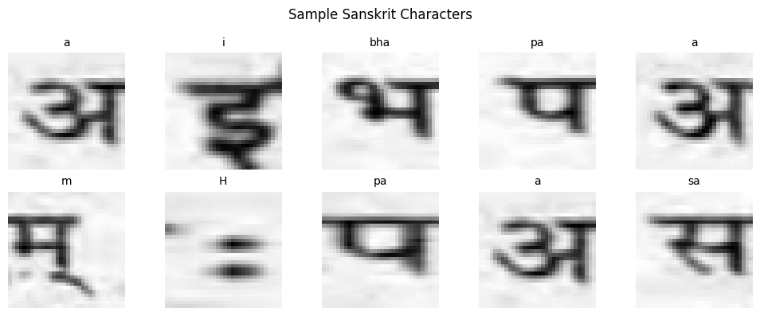
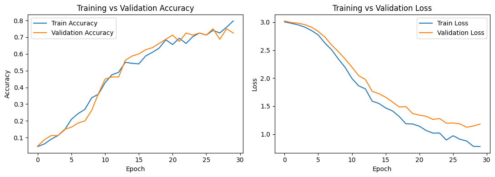
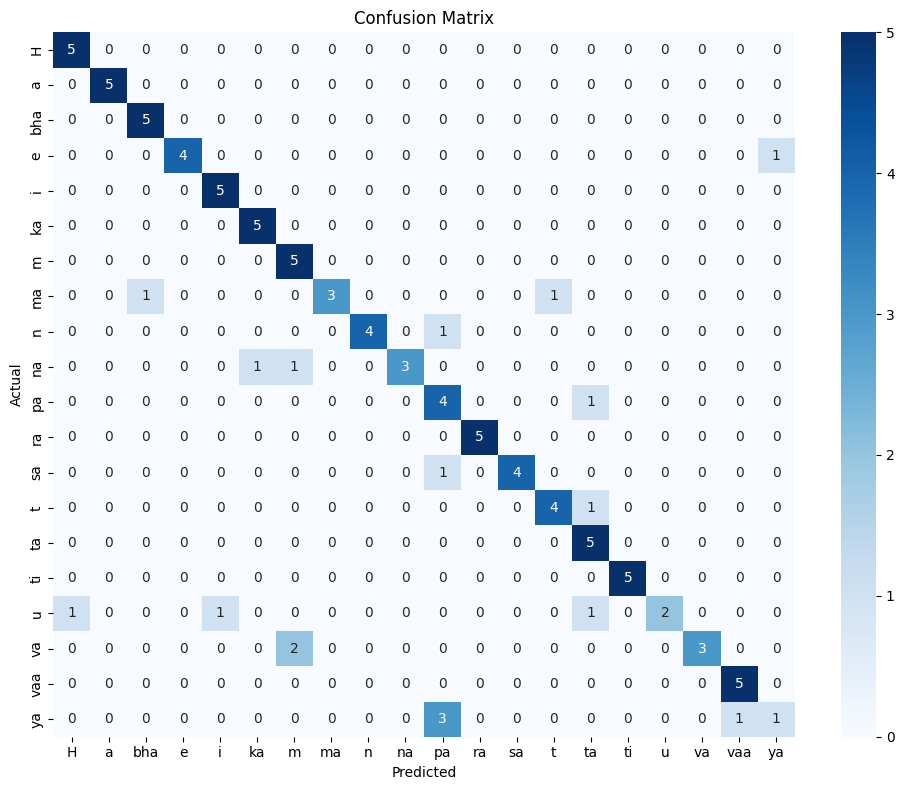
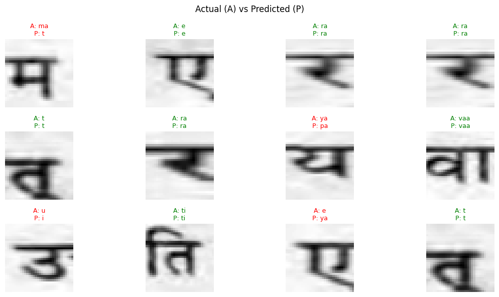

# Sanskrit Character Recognition using CNN

A convolutional neural network that classifies handwritten Sanskrit (Devanagari) characters segmented from real Sanskrit documents. Trained on a 20-class balanced subset of 500 images, the model reaches **82% test accuracy**.

[Open the notebook in Google Colab](https://colab.research.google.com/drive/1ee37kP7JTNx-CmdkOI9ywjfQH8DVdgsP)

---

## Table of contents

1. [Overview](#overview)
2. [Dataset](#dataset)
3. [Methodology](#methodology)
4. [Model architecture](#model-architecture)
5. [Results](#results)
6. [Error analysis](#error-analysis)
7. [Limitations](#limitations)
8. [Improvements](#improvements)
9. [Reproducing](#reproducing)

---

## Overview

| | |
|---|---|
| **Task** | 20-class image classification of Devanagari characters |
| **Input** | 32 × 32 grayscale images, single channel |
| **Model** | 2-block CNN, 79,892 trainable parameters |
| **Training data** | 400 images (320 train / 80 validation) |
| **Test data** | 100 images (5 per class) |
| **Test accuracy** | **82%** |
| **Macro F1** | 0.81 |
| **Random baseline** | 5% (1 / 20 classes) |

The model beats the random baseline by more than 16×. Its errors are not random — they concentrate on visually similar glyph pairs, which is analysed in detail below.

---

## Dataset

**Sanskrit Letter Dataset** — DevDigitizer Project, BITS Pilani
<https://github.com/avadesh02/Sanskrit-letter-dataset>

| Property | Value |
|---|---|
| Total images | 7,702 |
| Total classes | 602 |
| Source | Letters segmented from real Sanskrit documents |
| Labelling | I-Trans transliteration |
| Original image shape | `(32, 32, 3)` |
| Distributed as | `dev_letter_D.p` (Python pickle) |

Each pickle entry is a 3-tuple:

1. the image array
2. the class index
3. the English (I-Trans) label of the Sanskrit letter

### Subset selection

The full dataset spans 602 classes with a heavily skewed distribution, so this project uses a small balanced subset:

```python
NUM_CLASSES      = 20   # number of Sanskrit letters
IMAGES_PER_CLASS = 25   # images taken per letter
IMG_SIZE         = 32   # image size (32 x 32)
EPOCHS           = 30
```

Classes are the 20 most frequent purely alphabetic labels:

```
H, a, bha, e, i, ka, m, ma, n, na, pa, ra, sa, t, ta, ti, u, va, vaa, ya
```

**20 classes × 25 images = 500 images total.**

### Sample characters



Ten randomly drawn training images with their I-Trans labels. Several properties of the data are visible here and matter for the results:

- **The horizontal headstroke (शिरोरेखा)** runs across the top of nearly every glyph. It is shared by all classes, so it carries no discriminative signal — the network has to learn to ignore roughly the top fifth of every image.
- **Real scan artifacts.** These are segmented from documents, not synthesised: the backgrounds are grey and uneven, with visible ink bleed and blur.
- **Aggressive downsampling.** At 32 × 32 the fine strokes that separate similar glyphs are only 2–3 pixels wide. This is the root cause of most confusions reported below.
- **`H` is a diacritic**, not a full letter — the visarah, two small dots. It occupies far less of the frame than any other class.

---

## Methodology

### Preprocessing

| Step | Detail |
|---|---|
| Colour conversion | BGR → grayscale (`cv2.COLOR_BGR2GRAY`) |
| Resize | 32 × 32 |
| Normalise | divide by 255.0 |
| Reshape | `(N, 32, 32, 1)` — CNNs need a 4D tensor with an explicit channel axis |

```
Data shape:   (500, 32, 32)
Labels shape: (500,)
```

### Train / test split

Stratified 80/20, so every letter appears proportionally in both sets:

```python
X_train, X_test, Y_train, Y_test = train_test_split(
    X, Y, test_size=0.2, random_state=42, stratify=Y)
```

```
Training data shape: (400, 32, 32)  ->  (400, 32, 32, 1)
Testing  data shape: (100, 32, 32)  ->  (100, 32, 32, 1)
```

A further `validation_split=0.2` during `fit()` carves the 400 training images into **320 train / 80 validation**.

### Label encoding

String labels → integers via `LabelEncoder`, then one-hot via `to_categorical` for the softmax output.

### Reproducibility

```python
np.random.seed(42)
tf.random.set_seed(42)
```

---

## Model architecture

```python
model = Sequential([
    Input((IMG_SIZE, IMG_SIZE, 1)),

    Conv2D(16, (3, 3), activation='relu'),
    MaxPooling2D((2, 2)),

    Conv2D(32, (3, 3), activation='relu'),
    MaxPooling2D((2, 2)),

    Flatten(),
    Dense(64, activation='relu'),
    Dropout(0.4),
    Dense(NUM_CLASSES, activation='softmax')
])
```

| Layer | Output shape | Params |
|---|---|---|
| `Conv2D` (16 filters) | (None, 30, 30, 16) | 160 |
| `MaxPooling2D` | (None, 15, 15, 16) | 0 |
| `Conv2D` (32 filters) | (None, 13, 13, 32) | 4,640 |
| `MaxPooling2D` | (None, 6, 6, 32) | 0 |
| `Flatten` | (None, 1152) | 0 |
| `Dense` | (None, 64) | 73,792 |
| `Dropout` (0.4) | (None, 64) | 0 |
| `Dense` (softmax) | (None, 20) | 1,300 |

**Total trainable params: 79,892 (312.08 KB)**

### Design notes

- **Deliberately small.** With 320 training images, a deeper network would memorise the set within a few epochs. Even at this size the model has 79,892 parameters for 320 examples — roughly 250 parameters per image.
- **92% of parameters sit in one layer.** The `Flatten` → `Dense(64)` connection alone accounts for 73,792 of the 79,892 weights. The convolutional feature extractor is only 4,800 parameters. Replacing the flatten with `GlobalAveragePooling2D` would cut the model by an order of magnitude.
- **Dropout 0.4** before the classifier is the only regulariser — no augmentation, no weight decay, no batch norm.

### Training configuration

```python
model.compile(optimizer='adam',
              loss='categorical_crossentropy',
              metrics=['accuracy'])

history = model.fit(X_train, Y_train_cat,
                    epochs=30,
                    batch_size=32,
                    validation_split=0.2,
                    verbose=1)
```

---

## Results

### Headline

```
Test Accuracy: 0.82
```

### Training and validation curves



Reading these two plots together tells the real story of the run:

**Phase 1 — epochs 0–7, the slow start.** Accuracy crawls from 0.047 to ~0.24 and loss barely moves off 3.0 (= `ln(20)`, exactly the cross-entropy of uniform guessing over 20 classes). The network is still finding the headstroke and basic stroke orientation; it has learned almost nothing class-specific.

**Phase 2 — epochs 8–20, rapid learning.** The steep section. Accuracy climbs from 0.24 to ~0.69 and loss drops from 2.5 to 1.2. Train and validation move together almost perfectly here.

**Phase 3 — epochs 20–30, plateau and divergence.** Accuracy flattens in the 0.70–0.75 band and becomes noticeably jagged — with only 80 validation images, one image is 1.25 percentage points, so those spikes are sampling noise rather than real swings.

**The generalisation gap is visible and widening.** By the final epoch, training accuracy reaches ~0.80 while validation sits at ~0.73, and more tellingly **training loss falls to 0.78 while validation loss flattens around 1.15–1.19 and ticks slightly upward after epoch 28**. Loss diverges before accuracy does — the model is growing more confident about training examples without getting more correct on held-out ones. This is the onset of overfitting, mild but real.

The practical reading: **epoch 30 is close to the right stopping point for this configuration.** Training longer without adding regularisation or augmentation would widen the gap rather than improve validation performance. `EarlyStopping(monitor='val_loss', patience=5, restore_best_weights=True)` would have stopped around epoch 28 and kept the best weights automatically.

### Classification report

| Class | Precision | Recall | F1 | Support |
|---|---|---|---|---|
| H | 0.83 | 1.00 | 0.91 | 5 |
| a | 1.00 | 1.00 | **1.00** | 5 |
| bha | 0.83 | 1.00 | 0.91 | 5 |
| e | 1.00 | 0.80 | 0.89 | 5 |
| i | 0.83 | 1.00 | 0.91 | 5 |
| ka | 0.83 | 1.00 | 0.91 | 5 |
| m | 0.62 | 1.00 | 0.77 | 5 |
| ma | 1.00 | 0.60 | 0.75 | 5 |
| n | 1.00 | 0.80 | 0.89 | 5 |
| na | 1.00 | 0.60 | 0.75 | 5 |
| pa | 0.44 | 0.80 | 0.57 | 5 |
| ra | 1.00 | 1.00 | **1.00** | 5 |
| sa | 1.00 | 0.80 | 0.89 | 5 |
| t | 0.80 | 0.80 | 0.80 | 5 |
| ta | 0.62 | 1.00 | 0.77 | 5 |
| ti | 1.00 | 1.00 | **1.00** | 5 |
| u | 1.00 | 0.40 | **0.57** | 5 |
| va | 1.00 | 0.60 | 0.75 | 5 |
| vaa | 0.83 | 1.00 | 0.91 | 5 |
| ya | 0.50 | 0.20 | **0.29** | 5 |
| **accuracy** | | | **0.82** | 100 |
| **macro avg** | 0.86 | 0.82 | 0.81 | 100 |
| **weighted avg** | 0.86 | 0.82 | 0.81 | 100 |

Three classes are perfect (`a`, `ra`, `ti`). Macro and weighted averages are identical because the test set is perfectly balanced at 5 images per class.

---

## Error analysis

### Confusion matrix



Eighteen errors out of 100. The matrix is strongly diagonal, and the off-diagonal mass is concentrated rather than scattered:

| Actual | Predicted as | Count | Why it is plausible |
|---|---|---|---|
| `ya` | `pa` | **3** | य and प share the left vertical + bowl; at 32 × 32 the distinguishing middle stroke of य is a few pixels |
| `va` | `m` | **2** | व and म both reduce to a closed loop hanging under the headstroke |
| `u` | `H`, `i`, `ta` | 1 each | उ is scattered three different ways — the only class with no dominant confusion |
| `na` | `ka`, `m` | 1 each | |
| `ma` | `bha`, `t` | 1 each | म and भ differ mainly in the left-side stroke |
| `e`, `n`, `pa`, `sa`, `t` | 1 each | 1 | isolated single errors |

**The `ya` → `pa` collapse is the single biggest failure.** It costs `ya` most of its recall (0.20) and simultaneously destroys `pa`'s precision (0.44) — `pa` receives 5 false positives (3 from `ya`, 1 each from `n` and `sa`) while only having 5 true instances. One confusion pair is therefore responsible for two of the three worst F1 scores in the table.

**`u` fails differently.** Where `ya` collapses into one specific wrong class, `u` scatters across `H`, `i` and `ta` with no pattern. That suggests the model has not formed a coherent representation of `u` at all, rather than confusing it with one lookalike — a data problem more than a similarity problem.

**The errors are asymmetric.** `ya` → `pa` happens 3 times; `pa` → `ya` never happens. `va` → `m` happens twice; `m` → `va` never. The model has a directional bias toward the more "generic" glyph shape, which is what you would expect when fine detail is lost to downsampling.

### Sample predictions



Twelve random test images, green where correct and red where wrong. The visible failures are instructive:

- **`ya` → `pa`** — the headline confusion, caught in the act.
- **`ma` → `t`** and **`e` → `ya`** — both involve glyphs whose distinguishing feature is a thin stroke largely lost at this resolution.
- **`u` → `i`** — consistent with `u`'s scattered failure mode.

The correct predictions (`ra` twice, `e`, `t` twice, `vaa`, `ti`) are all glyphs with a distinctive, high-contrast silhouette that survives downsampling intact.

---

## Single-image inference

Demonstrates the full path from an image file on disk to a prediction:

```python
cv2.imwrite("test_char.png", (X_test[0].reshape(IMG_SIZE, IMG_SIZE) * 255).astype(np.uint8))

img = cv2.imread("test_char.png", cv2.IMREAD_GRAYSCALE)
img = cv2.resize(img, (IMG_SIZE, IMG_SIZE))
img = img / 255.0
img = img.reshape(1, IMG_SIZE, IMG_SIZE, 1)

prediction = model.predict(img)
print("Predicted Character:", class_names[np.argmax(prediction)])
print("Actual Character   :", class_names[Y_test_enc[0]])
print("Confidence         :", np.max(prediction))
```

```
Predicted Character: u
Actual Character   : u
Confidence         : 0.90301454
```

A new image must go through the **same** preprocessing as training — grayscale, resized to 32 × 32, scaled to `[0, 1]`, reshaped to `(1, 32, 32, 1)` — or the prediction is meaningless.

---

## Limitations

These bound how far the reported numbers should be trusted.

1. **The test set is 100 images.** The 95% confidence interval around 82% accuracy is roughly **±7.5 points** — the true accuracy plausibly lies anywhere from 74% to 89%. Treat 82% as an estimate, not a measurement.

2. **Five test images per class.** One misclassification moves a class's recall by 20 points. Per-class F1 scores are indicative only; `ya`'s 0.29 and `a`'s 1.00 are both single-digit-sample results.

3. **20 of 602 classes.** This is 3.3% of the real problem. Devanagari has many more confusable groups than appear here, so accuracy would fall substantially at full class count.

4. **No augmentation and a single run.** With one fixed seed and no cross-validation, the reported figure includes an unknown amount of split luck.

5. **Mild overfitting at the stopping point,** as the loss curves show — the model was not trained to its best possible validation performance, nor stopped early enough to avoid the gap entirely.

---

## Improvements

Ordered by expected impact per unit of effort:

1. **Use more data.** 25 images per class is the binding constraint. The source has 7,702 images; raising `IMAGES_PER_CLASS` is the single highest-impact change available and costs nothing but runtime.

2. **Add augmentation** — small rotations (±10°), shifts and zooms. At this dataset size this is the standard remedy for exactly the gap visible in the loss curves.

3. **Add `EarlyStopping` with `restore_best_weights=True`.** Removes the guesswork about epoch count and recovers the ~epoch-28 weights automatically.

4. **Raise input resolution above 32 × 32.** The dominant errors (`ya`/`pa`, `va`/`m`) are all fine-stroke confusions. More pixels attack the actual cause rather than the symptom.

5. **Swap `Flatten` for `GlobalAveragePooling2D`.** Cuts ~74k of 80k parameters, which directly reduces overfitting capacity.

6. **Add `BatchNormalization`** after the conv layers — would shorten the flat 8-epoch start visible in the accuracy curve.

7. **Target the confusable pairs** with extra samples of `ya`, `u` and `va`, the three weakest classes.

8. **Report a confidence interval,** and ideally k-fold cross-validation, so the headline number carries its own uncertainty.

---

## Reproducing

### Requirements

```bash
pip install -r requirements.txt
```

or directly:

```bash
pip install numpy opencv-python matplotlib seaborn scikit-learn tensorflow
```

### Get the data

```bash
wget -q https://raw.githubusercontent.com/avadesh02/Sanskrit-letter-dataset/master/dev_letter_D.p
```

```python
db = pickle.load(open("dev_letter_D.p", "rb"), encoding="latin1")
```

> `encoding="latin1"` is required — the pickle was written under Python 2.

### Saving the figures

To regenerate the images in `images/`, add a `savefig` before each `plt.show()`:

```python
plt.savefig("images/training_curves.png", dpi=150, bbox_inches="tight")
plt.show()
```

`bbox_inches="tight"` trims the whitespace; `dpi=150` keeps the text legible when GitHub scales the image down.

### Saving the model

```python
model.save("sanskrit_cnn_model.h5")
```

> Keras warns that HDF5 is the legacy format. Use `sanskrit_cnn_model.keras` to silence it.

### Running the standalone script

The notebook and `sanskrit_cnn.py` run the same pipeline. The script saves the figures
to disk instead of displaying them inline:

```bash
python sanskrit_cnn.py
```

Accuracy will not reproduce 82% exactly — see [Limitations](#limitations).

---

## Notebook structure

1. Download the dataset
2. Libraries
3. Load the dataset file
4. Select a small subset of classes
5. Load and preprocess the images
6. Show some sample Sanskrit characters
7. Split into training and testing sets
8. Normalize the pixels and reshape for CNN
9. Encode the labels
10. Create the CNN model
11. Compile the model
12. Train the model
13. Predict on the test set
14. Calculate accuracy
15. Classification report
16. Confusion matrix
17. Training vs validation performance
18. Visualize classification results
19. Predict a single unseen character image
20. Save the trained model

---

## Repository layout

```
sanskrit-cnnfinal/
├── README.md
├── Sanskrit_Character_CNN.ipynb     # Colab notebook with saved outputs
├── sanskrit_cnn.py                  # same pipeline as a standalone script
├── requirements.txt                 # dependencies
├── .gitignore
└── images/
    ├── sample_characters.png
    ├── training_curves.png
    ├── confusion_matrix.png
    └── predictions.png
```

---

## Credits

Dataset: [DevDigitizer Project](https://github.com/avadesh02/Sanskrit-letter-dataset), BITS Pilani.
